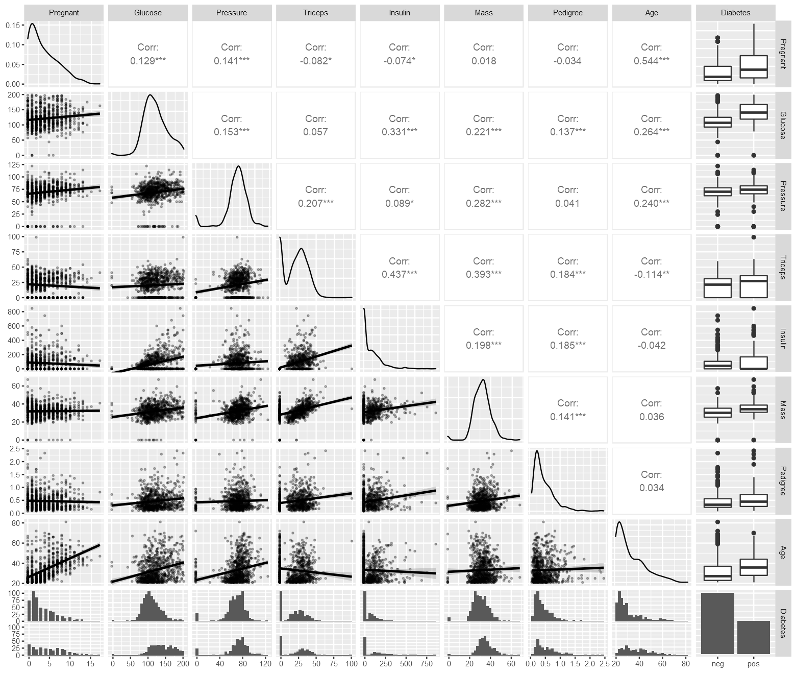

# Diabetes Prediction using R

## Get the Data

### Loading the required libraries


```R
library(mlbench)
library(ggplot2)
library(dplyr)
library(GGally)
library(knitr)
library(e1071)
library(caTools)
library(ROCR)
library(caret)
library(lattice)
library(rpart)
library(rpart.plot)
library(tree)
library(heatmaply)
library(factoextra)
library(rattle)
library(DT)
library(rmarkdown)
library(xtable)
library(IRdisplay)
library(repr)
```

    Warning message:
    "package 'mlbench' was built under R version 3.6.3"Warning message:
    "package 'dplyr' was built under R version 3.6.3"
    Attaching package: 'dplyr'
    
    The following objects are masked from 'package:stats':
    
        filter, lag
    
    The following objects are masked from 'package:base':
    
        intersect, setdiff, setequal, union
    
    Registered S3 method overwritten by 'GGally':
      method from   
      +.gg   ggplot2
    Warning message:
    "package 'e1071' was built under R version 3.6.3"Warning message:
    "package 'caTools' was built under R version 3.6.3"Warning message:
    "package 'ROCR' was built under R version 3.6.3"Loading required package: lattice
    Warning message:
    "package 'rpart.plot' was built under R version 3.6.3"Warning message:
    "package 'tree' was built under R version 3.6.3"Warning message:
    "package 'heatmaply' was built under R version 3.6.3"Loading required package: plotly
    Warning message:
    "package 'plotly' was built under R version 4.2.0"
    Attaching package: 'plotly'
    
    The following object is masked from 'package:ggplot2':
    
        last_plot
    
    The following object is masked from 'package:stats':
    
        filter
    
    The following object is masked from 'package:graphics':
    
        layout
    
    Loading required package: viridis
    Warning message:
    "package 'viridis' was built under R version 3.6.3"Loading required package: viridisLite
    Warning message:
    "package 'viridisLite' was built under R version 3.6.3"Registered S3 methods overwritten by 'registry':
      method               from 
      print.registry_field proxy
      print.registry_entry proxy
    
    ======================
    Welcome to heatmaply version 1.2.1
    
    Type citation('heatmaply') for how to cite the package.
    Type ?heatmaply for the main documentation.
    
    The github page is: https://github.com/talgalili/heatmaply/
    Please submit your suggestions and bug-reports at: https://github.com/talgalili/heatmaply/issues
    Or contact: <tal.galili@gmail.com>
    ======================
    
    Warning message:
    "package 'factoextra' was built under R version 3.6.3"Welcome! Want to learn more? See two factoextra-related books at https://goo.gl/ve3WBa
    Warning message:
    "package 'rattle' was built under R version 3.6.3"Loading required package: tibble
    Warning message:
    "package 'tibble' was built under R version 3.6.3"Loading required package: bitops
    Warning message:
    "package 'bitops' was built under R version 3.6.3"Rattle: A free graphical interface for data science with R.
    Version 5.4.0 Copyright (c) 2006-2020 Togaware Pty Ltd.
    Type 'rattle()' to shake, rattle, and roll your data.
    Warning message:
    "package 'DT' was built under R version 3.6.3"Warning message:
    "package 'IRdisplay' was built under R version 3.6.3"
    Attaching package: 'IRdisplay'
    
    The following object is masked from 'package:xtable':
    
        display
    
    

### Loading the dataset


```R
data(PimaIndiansDiabetes)
df = PimaIndiansDiabetes
```

### Changing the Column Names


```R
colnames(df) = c("Pregnant","Glucose", "Pressure", "Triceps","Insulin", "Mass","Pedigree","Age","Diabetes")
display_html(paste(capture.output(print(head(xtable(df),8), type = 'html')), collapse="", sep=" "))
```


<!-- html table generated in R 3.6.1 by xtable 1.8-4 package --><!-- Thu Jul 22 07:56:21 2021 --><table border=1><tr> <th>  </th> <th> Pregnant </th> <th> Glucose </th> <th> Pressure </th> <th> Triceps </th> <th> Insulin </th> <th> Mass </th> <th> Pedigree </th> <th> Age </th> <th> Diabetes </th>  </tr>  <tr> <td align="right"> 1 </td> <td align="right"> 6.00 </td> <td align="right"> 148.00 </td> <td align="right"> 72.00 </td> <td align="right"> 35.00 </td> <td align="right"> 0.00 </td> <td align="right"> 33.60 </td> <td align="right"> 0.63 </td> <td align="right"> 50.00 </td> <td> pos </td> </tr>  <tr> <td align="right"> 2 </td> <td align="right"> 1.00 </td> <td align="right"> 85.00 </td> <td align="right"> 66.00 </td> <td align="right"> 29.00 </td> <td align="right"> 0.00 </td> <td align="right"> 26.60 </td> <td align="right"> 0.35 </td> <td align="right"> 31.00 </td> <td> neg </td> </tr>  <tr> <td align="right"> 3 </td> <td align="right"> 8.00 </td> <td align="right"> 183.00 </td> <td align="right"> 64.00 </td> <td align="right"> 0.00 </td> <td align="right"> 0.00 </td> <td align="right"> 23.30 </td> <td align="right"> 0.67 </td> <td align="right"> 32.00 </td> <td> pos </td> </tr>  <tr> <td align="right"> 4 </td> <td align="right"> 1.00 </td> <td align="right"> 89.00 </td> <td align="right"> 66.00 </td> <td align="right"> 23.00 </td> <td align="right"> 94.00 </td> <td align="right"> 28.10 </td> <td align="right"> 0.17 </td> <td align="right"> 21.00 </td> <td> neg </td> </tr>  <tr> <td align="right"> 5 </td> <td align="right"> 0.00 </td> <td align="right"> 137.00 </td> <td align="right"> 40.00 </td> <td align="right"> 35.00 </td> <td align="right"> 168.00 </td> <td align="right"> 43.10 </td> <td align="right"> 2.29 </td> <td align="right"> 33.00 </td> <td> pos </td> </tr>  <tr> <td align="right"> 6 </td> <td align="right"> 5.00 </td> <td align="right"> 116.00 </td> <td align="right"> 74.00 </td> <td align="right"> 0.00 </td> <td align="right"> 0.00 </td> <td align="right"> 25.60 </td> <td align="right"> 0.20 </td> <td align="right"> 30.00 </td> <td> neg </td> </tr>  <tr> <td align="right"> 7 </td> <td align="right"> 3.00 </td> <td align="right"> 78.00 </td> <td align="right"> 50.00 </td> <td align="right"> 32.00 </td> <td align="right"> 88.00 </td> <td align="right"> 31.00 </td> <td align="right"> 0.25 </td> <td align="right"> 26.00 </td> <td> pos </td> </tr>  <tr> <td align="right"> 8 </td> <td align="right"> 10.00 </td> <td align="right"> 115.00 </td> <td align="right"> 0.00 </td> <td align="right"> 0.00 </td> <td align="right"> 0.00 </td> <td align="right"> 35.30 </td> <td align="right"> 0.13 </td> <td align="right"> 29.00 </td> <td> neg </td> </tr>   </table>


## Data Exploration

### Checking the Data Types


```R
str(df)
```

    'data.frame':	768 obs. of  9 variables:
     $ Pregnant: num  6 1 8 1 0 5 3 10 2 8 ...
     $ Glucose : num  148 85 183 89 137 116 78 115 197 125 ...
     $ Pressure: num  72 66 64 66 40 74 50 0 70 96 ...
     $ Triceps : num  35 29 0 23 35 0 32 0 45 0 ...
     $ Insulin : num  0 0 0 94 168 0 88 0 543 0 ...
     $ Mass    : num  33.6 26.6 23.3 28.1 43.1 25.6 31 35.3 30.5 0 ...
     $ Pedigree: num  0.627 0.351 0.672 0.167 2.288 ...
     $ Age     : num  50 31 32 21 33 30 26 29 53 54 ...
     $ Diabetes: Factor w/ 2 levels "neg","pos": 2 1 2 1 2 1 2 1 2 2 ...
    

We can see that there are 9 different variables 8 of them are numeric while the last one is a categorical variable.

### Checking the missing values count


```R
# Creating a function to determine missing values in each column
nullvalues = function(dataset) {
aa = c()
bb = c()
for (count in 1:length(dataset)) {
  aa <- append(aa,colnames(dataset)[count])
  bb <- append(bb,sum(is.na(dataset[colnames(dataset)[count]])))
}
missing_values=NULL
missing_values$Columns <- aa
missing_values$`Missing Values Count` <- bb
missing_values <- data.frame(missing_values)

display_html(paste(capture.output(print(xtable(missing_values), type = 'html')), collapse="", sep=" "))

}

# Using the function to determine missing values in df
nullvalues(df)
```


<!-- html table generated in R 3.6.1 by xtable 1.8-4 package --><!-- Thu Jul 22 07:56:21 2021 --><table border=1><tr> <th>  </th> <th> Columns </th> <th> Missing.Values.Count </th>  </tr>  <tr> <td align="right"> 1 </td> <td> Pregnant </td> <td align="right">   0 </td> </tr>  <tr> <td align="right"> 2 </td> <td> Glucose </td> <td align="right">   0 </td> </tr>  <tr> <td align="right"> 3 </td> <td> Pressure </td> <td align="right">   0 </td> </tr>  <tr> <td align="right"> 4 </td> <td> Triceps </td> <td align="right">   0 </td> </tr>  <tr> <td align="right"> 5 </td> <td> Insulin </td> <td align="right">   0 </td> </tr>  <tr> <td align="right"> 6 </td> <td> Mass </td> <td align="right">   0 </td> </tr>  <tr> <td align="right"> 7 </td> <td> Pedigree </td> <td align="right">   0 </td> </tr>  <tr> <td align="right"> 8 </td> <td> Age </td> <td align="right">   0 </td> </tr>  <tr> <td align="right"> 9 </td> <td> Diabetes </td> <td align="right">   0 </td> </tr>   </table>


 Clearly none of the columns have missing values.

### Scatter Matrix Plot


```R
options(repr.plot.width=13, repr.plot.height=11)
ggpairs(df, lower = list(continuous = wrap("smooth", alpha = 0.3, size=0.5)))
```

    `stat_bin()` using `bins = 30`. Pick better value with `binwidth`.
    `stat_bin()` using `bins = 30`. Pick better value with `binwidth`.
    `stat_bin()` using `bins = 30`. Pick better value with `binwidth`.
    `stat_bin()` using `bins = 30`. Pick better value with `binwidth`.
    `stat_bin()` using `bins = 30`. Pick better value with `binwidth`.
    `stat_bin()` using `bins = 30`. Pick better value with `binwidth`.
    `stat_bin()` using `bins = 30`. Pick better value with `binwidth`.
    `stat_bin()` using `bins = 30`. Pick better value with `binwidth`.
    


    

    


### Class distribution and skewness


```R
y <- df$Diabetes
xtable((cbind(freq=table(y), percentage=prop.table(table(y))*100)))
#df_skew <- apply(df[,1:8], 2, skewness)

```


<table>
<thead><tr><th></th><th scope=col>freq</th><th scope=col>percentage</th></tr></thead>
<tbody>
	<tr><th scope=row>neg</th><td>500     </td><td>65.10417</td></tr>
	<tr><th scope=row>pos</th><td>268     </td><td>34.89583</td></tr>
</tbody>
</table>


```R
skew_df = data.frame("Column_names" = as.character(), "Skewness" = as.numeric(), stringsAsFactors = F)
for (i1 in 1:8) {
  skew_df[i1,1:2]= rep(1,length(1:8)) 
  skew_df[i1,1] = colnames(df[i1])
  skew_df[i1,2] = skewness(df[,i1])
}
skew_df
```


<table>
<thead><tr><th scope=col>Column_names</th><th scope=col>Skewness</th></tr></thead>
<tbody>
	<tr><td>Pregnant  </td><td> 0.8981549</td></tr>
	<tr><td>Glucose   </td><td> 0.1730754</td></tr>
	<tr><td>Pressure  </td><td>-1.8364126</td></tr>
	<tr><td>Triceps   </td><td> 0.1089456</td></tr>
	<tr><td>Insulin   </td><td> 2.2633826</td></tr>
	<tr><td>Mass      </td><td>-0.4273073</td></tr>
	<tr><td>Pedigree  </td><td> 1.9124179</td></tr>
	<tr><td>Age       </td><td> 1.1251880</td></tr>
</tbody>
</table>


```R

```


```R

```


```R

```


```R

```


```R

```


```R

```
